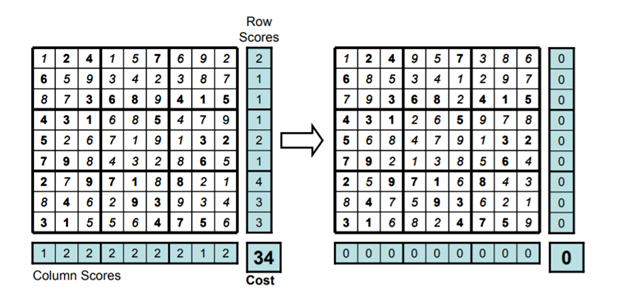
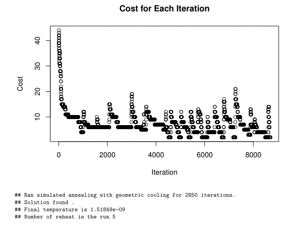
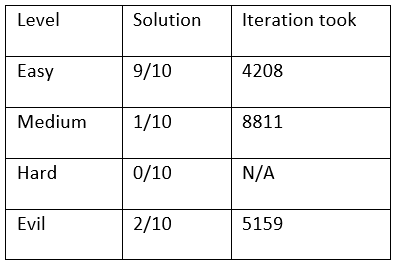
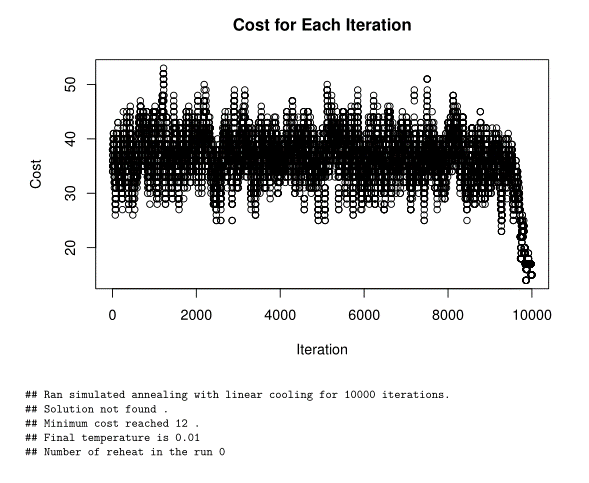
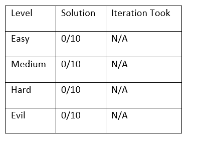
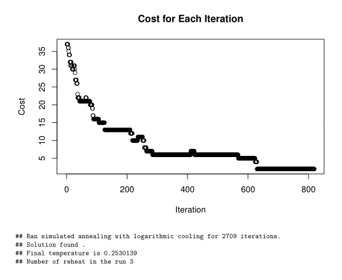
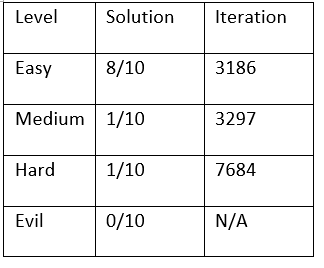

```{r setup, include=FALSE}
knitr::opts_chunk$set(echo = TRUE)
```


# 1 Introduction 

Sudoku is a famous, logic-based, number-placement puzzle that has appeared since 1979. The objective of classic sudoku is to fill a 9 by 9 grid with numbers from 1 to 9 so that each column, each row, and each of the 3 by 3 distinct sub-grid contains all of the digits from 1 to 9. Additionally, there will be some numbers that are fixed to some cell in the grid, the goal is to fill in the rest of the cells. 
In this paper, I am going to first show you how simulated annealing can help in solving classic sudoku. Then, I will compare between geometric, linear and logarithmic cooling schedule in terms of its ability in solving various level of sudoku and the number of iterations it took to find the solution. 

# 2 Methods
## 2.1	Set-up in Solving Sudoku
1.	For each of the 3 by 3 sub-grid, randomly fill in  the non-fixed cells such that the sub-grid contains numbers from 1 to 9 exactly once. Then we will have a completed filled grid such that every sub-grid contains number from 1 to 9 only once.
2.	In each iteration, randomly choose a sub-grid and randomly choose two cells non-fixed within the chosen sub-gird. Then swap the value in the selected two cells. This is our new proposal. 
3.	Keep swapping the cells within same sub-grid until we reach the solution

## 2.2	Cost Function 

The rules of sudoku are to have numbers from 1 to 0 appear exactly once in each of the row, column, and the sub-grid. Based on my set-up, the criterion that every sub-grid contains number from 1 to 9 only once is always satisfied. Thus, we only need to worry about the numbers along the rows and columns. Therefore, I can evaluate the candidate solution by summing up the numbers of duplicates in each row and columns. When there is no duplicate in any of the row and column that means I reach my solution my cost function is equal to zero. 




## 2.3	Simulated Annealing and Temperature
Now with our cost function, this sudoku puzzle is now a minimization problem, which we can solve by simulated annealing algorithm. The idea of simulated annealing is to randomly search through the possible number placement so that the new proposed number placement will have a lower cost. However, the algorithm may be stuck in some local minimum in stead of finding the global minimum. This is where the temperature comes in. In each iteration, any two non-fixed cells within same sub-grid are swapped, this is our new proposal. Then, this new proposal is accepted if:

a.	The cost of the new proposal is lower than the previous candidate, or 
b.	It is accepted with a probability: $exp(-\delta/t)$ where $\delta$ is the proposed change in the cost function and t is the temperature parameter.
The proposal is accepted if any of the two conditions are meet.

For a large t value, the algorithm will accept and explores a lot different number placement, which is good at the beginning of the search. For a small t value, the algorithm will only accept if it improves the cost function, this is good at end of search because it is close to the minimum of the cost function. So, we choose an initial t value, and it should be slowly reduced as we get close to the minimum. The rate we decrease the temperature is called cooling schedule. 

## 2.4	Cooling Schedule
There are many cooling schedules that we can use for simulated annealing. I am going to experiment with geometric, linear and logarithmic cooling schedule. Then, I will evaluate each of the performance by its ability to solve sudoku in three different level of difficulty(easy, medium, and evil in https://www.websudoku.com/) and the number of iterations it took to find the solution. 

### 2.4.1 Geometric cooling schedule 
In geometric cooling schedule, the temperature is reduced by $t_{i+1} = \alpha * t_i$, where $\alpha$ is called the cooling rate, and 0< $\alpha$ <1. For a large value of $\alpha$, the temperature will drop very slowly, but for a lower $\alpha$, the temperature will drop much quicker.

### 2.4.2	Linear cooling schedule
In linear cooling schedule, the temperature is reduced by $t_{i+1} = t_{i} - d$, where d > 0, and d is chosen so that t is still positive for any iteration of the run.

### 2.4.3	Logarithmic cooling schedule
In logarithmic cooling schedule, the temperature is reduced by $t_{i+1} = c/ log(1+i)$, where $i$ is the number of iterations and c is a parameter.

```{r echo=FALSE, fig.height=3, fig.width=8, fig.cap="Cooling Schedule"}
par(mfrow=c(1,3))
Iteration = 0:1000
t = 50*0.9^Iteration
exp <- plot(Iteration,t, main="Geometric cooling schedule")

t = 50 - Iteration*((50 - 0.01)/1000)
line <- plot(Iteration,t, main="Linear cooling schedule")

y = 2
t = c(2)
for (i in 1:1000){
  y = 2/log(1 + i)
  t = c(t, y)
}
lo <- plot(Iteration,t, main ="Logarithmic cooling schedule")


```

### 2.5	Reheat process 

Lastly, I added a reheat process to prevent the algorithm to stuck in a local minimum. The reheat process works as the following: if there are no improvement in the cost for a fixed number of iteration (It was set to 80 for my algorithm), then we increase t by some fixed number(reheat temperature) so that the algorithm started to accept more and explore different number placement.

## 3 Results
For all three cooling schedule, I allow each of them to run 10000 iteration to solve 4 different level sudoku for 10 times. Then I will check the solve rate for each cooling schedule and the number of iteration it took. 

### 3.1 Geometric cooling schedule 
In geometric cooling schedule, I set the cooling rate to be 0.9 and reheat temperature to be 5. 




As we see from the result that geometric cooling can solve easy level pretty consistently with 9 out of 10 times and average iteration of 4208. However, as the difficulty increase, the algorithm started to have problems in solving sudoku within 10000 iteration. The solve rate dropped significantly, only 1 out of 10 times for medium level, 2 out of 10 times for evil level, and 0 times for hard level. But, this also means that the algorithm is able to solve the sudoku if we give a lot more iteration. 




### 3.2	Linear cooling schedule 
In geometric cooling schedule, I set reheat temperature to be 1. 




For linear cooling schedule, it is not good in solving sudoku. It spent way to much time in the beginning explore different number placement, and it only starts to try to reduce the cost at the very end. It also does not take the advantage of the reheat process, because the reduction in temperature is too slow so the algorithm usually accept the new proposal. 



### 3.3	Logarithmic cooling schedule
  
In logarithmic cooling schedule, I set the reheat temperature to be 10 and the c parameter to be 2. 



As we see in figure 2, the logarithmic cooling schedule reduce very fast in the beginning and slow down at the end. So, we see a repid reduction in the cost and the algorithm is slowly swapping between cells to find the minimum. Even when we reheat the temperature, the cost does not change significantly as we see in the geometric cooling. 

Based on the result, we see a similar pattern as we see in geometric cooling. For easy level, logarithmic can solve suduko pretty consistent. But it requires a lot more iteration for more difficult suduko. However, it managed to solve hard level once with 7684 iteration, but it does not solve evil level within 10000 iteration.



## Discussion 
Based on the result, we see that the cooling schedule have a significant impact on the ability in solving sudoku. liner cooling schedule is not able to solve soduku. Both geometric and logarithmic cooling schedule is capable to solve suduko if we give it enough time. I think geometric and logarithmic cooling schedule performed similarly because cooling rate starts reduce fast in the beginning and slowly at the end. This is the optimal characteristic of a cooling schedule in solving suduko, because gets very quickly to a stage to try reduce the cost and does not waste iteration on randomly swapping any two non-fixed cells that does not reduce cost. We also see that the reheat process plays a very important role in solving the sudoku. In terms of cost function, the reheat prevents the algorithm to stuck in a local minimum. In term of sudoku, what is it actually doing is to randomly swap some of the non-fixed cells and try hard to reduce the cost again. If we are lucky that we got some of numbers in the correct spot during our initially reheat process, it will be more likely to find the result. However, there is still a lot of randomness in our algorithm, but if we give enough time for any cooling schedule like geometric and logarithmic cooling schedule, it should be able to find the solution of the suduko fairly quickly.  


\newpage
## References

\newpage
## Appendices

